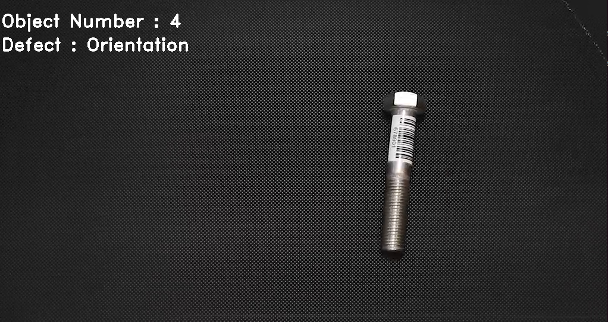
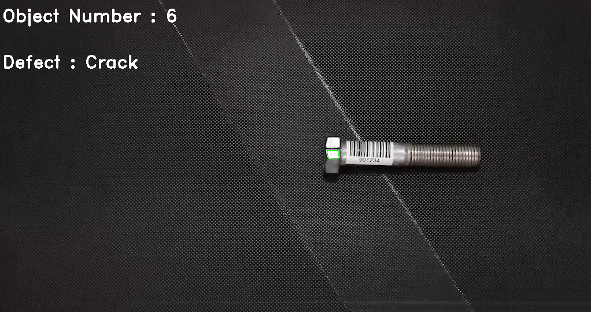
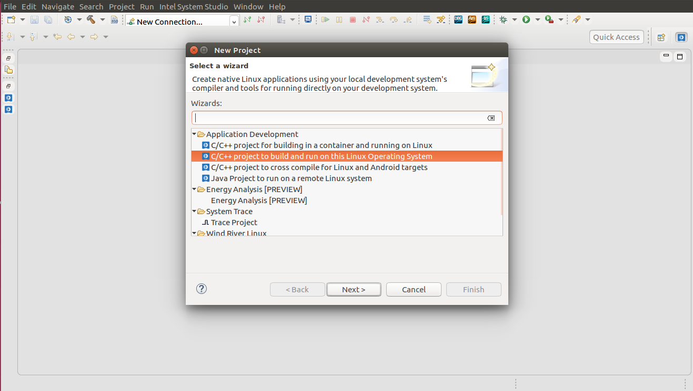
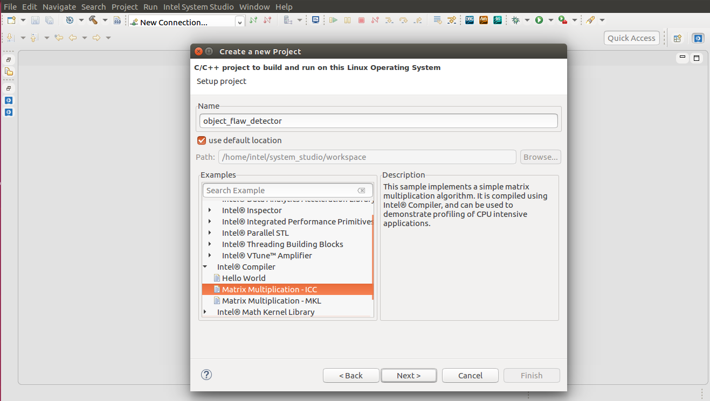
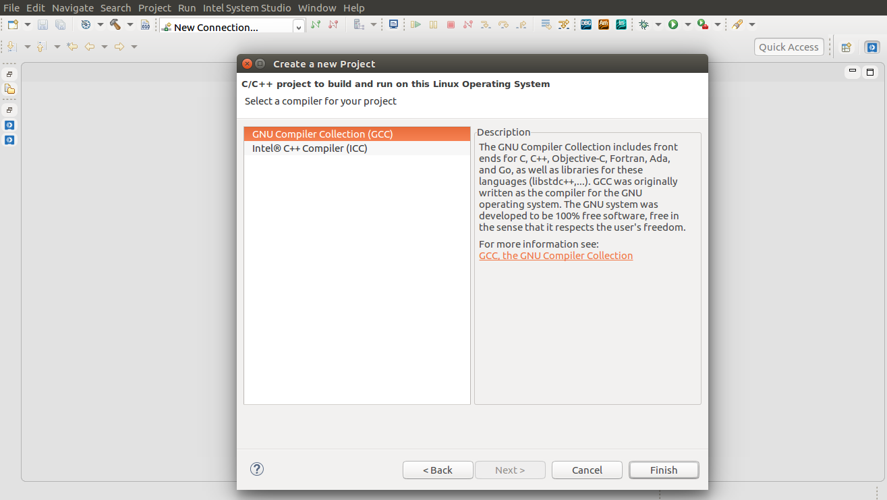
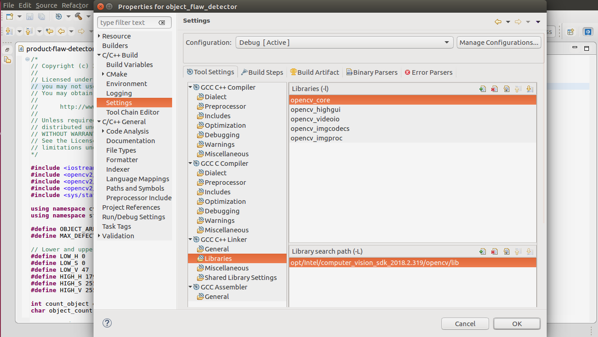
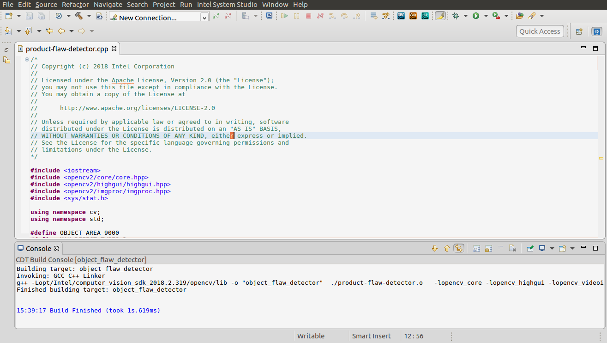
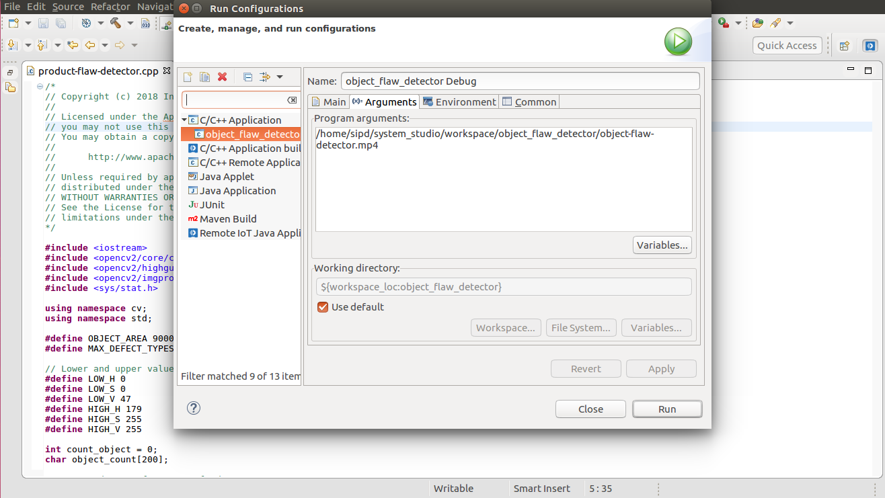
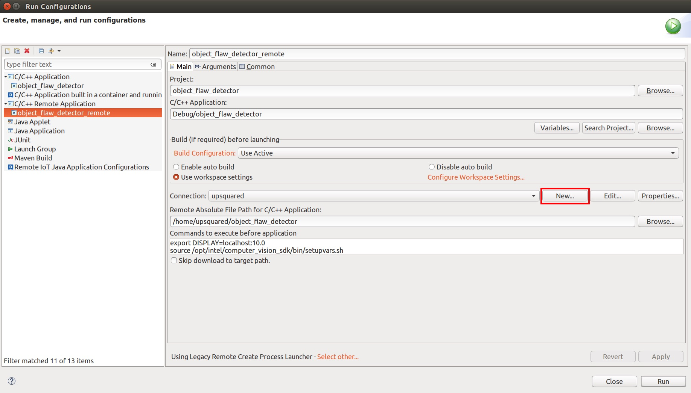
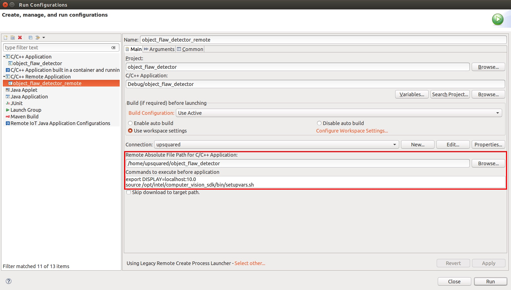

# Object Flaw Detector

| Details            |                 |
|-----------------------|------------------|
| Target OS:            |  Ubuntu\* 16.04 LTS     |
| Programming Language  |  C++ |
| Time to complete:     |  30 min      |


## Introduction

This object flaw detector application detects the anomalies present in the objects moving on a conveyor belt. The application identifies the number of objects moving on the conveyor belt and checks for the presence of defects in the color and orientation of the object. The objects are checked for the presence of cracks. The ones containing cracks are marked as defective.

## Requirements

* Ubuntu 16.04
* OpenVINO™ toolkit
* Intel® System Studio 2018

## How it works

* This application takes the input from a video camera or a video file for processing.


* Orientation defect detection: Get the frame and change the color space to HSV format. Threshold the image based on the color of the object using [inRange](https://docs.opencv.org/3.4.0/da/d97/tutorial_threshold_inRange.html) function to create a mask. Perform morphological opening and closing on the mask and find the contours using [findContours](https://docs.opencv.org/3.4.0/d4/d73/tutorial_py_contours_begin.html) function. Filter the contours based on the area. Perform [PCA](https://docs.opencv.org/3.4/d1/dee/tutorial_introduction_to_pca.html) on the contours to get the orientation of the object.



* Color anomaly detection: Threshold the image based on the defective color of the object using [inRange](https://docs.opencv.org/3.4.0/da/d97/tutorial_threshold_inRange.html) function. Use the mask obtained from the [inRange](https://docs.opencv.org/3.4.0/da/d97/tutorial_threshold_inRange.html) function to find the defective area.


* Crack detection: Transform the image from BGR to Grayscale format using [cvtColor](https://docs.opencv.org/3.4.3/d7/d1b/group__imgproc__misc.html#ga397ae87e1288a81d2363b61574eb8cab) function. Blur the image using [blur](https://docs.opencv.org/3.4.0/dc/dd3/tutorial_gausian_median_blur_bilateral_filter.html) function to remove the noises. Use the contours found on the blurred image to detect the cracks.



* Save the images of defective objects in their respective folders. For example, objects with color defect are saved in **color** folder, objects containing cracks are saved in **crack** folder and objects with no defect are stored in **no_defect** folder.

## Setting the build environment

On the system, open Intel® System Studio 2018 and choose your workspace.
1. Click **File -&gt; New -&gt; Project -&gt; Application Development**.
2. Select **C/C++ project to build and run on this Linux Operating System**.



3. Select **Intel Complier -&gt; Matrix Multiplication -ICC** example and change the name of the project to **object_flaw_detector**.



4. Click **Next**. Select Complier for the project as **GNU Compiler Collection (GCC)**. Click **Finish**.



5. Delete the file named **compiler_sample.cpp**(example code) from the Project Explorer.
6. Click **File -&gt; New -&gt; File**. Select the parent folder and name the new file as **product-flaw-detector.cpp**.
7. Copy the code from **product-flaw-detector.cpp** of this repository to the newly created file.


### Add Include Path
1. Select **Project -> Properties -> C/C++ General -> Paths and Symbols**
2. Select **Includes -> GNU C++** and Click on **Add...**
3. Add *opt/intel/computer\_vision\_sdk\_&lt;version&gt;/opencv/include* to include the path of OpenVINO™ toolkit.


### Add Libraries  
1. Select **Project -&gt; Properties -&gt; C/C++ Build -&gt; Settings -&gt; C++ Linker -&gt; Libraries**
2. Add *opt/intel/computer\_vision\_sdk\_&lt;version&gt;/opencv/lib* to ```Library Search Path (-L)```
3. Add **opencv_core, opencv_highgui, opencv_imgproc, opencv_imgcodecs, opencv_videoio** to the ```Libraries (-l)```



Select **Project -&gt; Properties -&gt; C/C++ Build -&gt; Settings -&gt; GCC C++ Compiler -&gt; Dialect**.
Select the Language standard as ISO **C++ 11(-std=c++0x)** and click **OK**.


### Build the project
1. Select **Project -&gt; Build Project** and click **OK**.



### Run the project
1. Select **Run -&gt; Run Configuration.. -&gt; C/C++ Application -&gt;**. Choose the project **object_flaw_detector**.
2. Click on **Arguments** and specify the path of the video under **Program Arguments**.
3. Click **Run**.




### Run object_flaw_detector as remote application on UP²* then display the results on your laptop
1. Preparation:


	a. To run a graphic application on remote device and display on your host, here we use X11 Forwarding with SSH, open another Terminal on your laptop, type below command and **keep this terminal open**

		ssh upsquared@10.42.0.xxx -X

	b. To get the read and write authority of the camera on the remote device, we need to type:

		sudo chmod 666 /dev/video0

	> **Note:** upsquared@upsquared-UP-APL01:~$ sudo chmod 666 /dev/video0


1. Right click **object_flaw_detector** from **Binaries**, select **Run As -> Run Configurations...**, then doulbe click **C/C++ Remote Application**, it will generate a configuration named interactive_face_detection_sample, rename it to **object_flaw_detector_remote**, click Apply

2. Click **New** button after **Connection:**
	<br>

	

	<br>
3. In the droplist, choose **SSH**
	<br>

	

	<br>
4. Then type **IP address** of your UP² board(10.42.0.xxx), username: **upsquared**, choose **password based authentication**, then type **upsquared** as password, then click Finish
	<br>

	

	<br>

5. In **Remote Absolute File Path for C/C++ Application**, type:

		/home/upsquared/interactive_face_detection_sample

6. In **Commands to execute before application**, type:
	> **Note:** *Remember to open a Terminal on your laptop, type **ssh upsquared@10.42.0.xxx -X** and keep this terminal open, for running a GUI application remotely and display it locally*

		export DISPLAY=localhost:10.0
		source /opt/intel/computer_vision_sdk/bin/setupvars.sh

	<br>

	

	<br>

6. Click **Arguments** tag, add below arguments in **Program arguments:** then click Apply and OK

		-m ${ROOT_DIR}/intel_models/face-detection-retail-0004/FP32/face-detection-retail-0004.xml -m_ag ${ROOT_DIR}/intel_models/age-gender-recognition-retail-0013/FP32/age-gender-recognition-retail-0013.xml -m_hp ${ROOT_DIR}/intel_models/head-pose-estimation-adas-0001/FP32/head-pose-estimation-adas-0001.xml -d CPU -d_ag CPU -d_hp CPU

	<br>

	

	<br>		

Now we can make a comparison of the performance running the same application between on our host laptop and on the UP² AI Vision kit, and you can load different models used here to different hardware by changing the arguments and see what is the optimized configuration for this application. More details of this sample project can be found from here: /opt/intel/computer_vision_sdk_2018.3.343/deployment_tools/documentation/docs/InferenceEngineInteractiveFaceDetectionSampleApplication.html

> **Note:** The output of the UP² AI Kit is too big for the display, we can resize the windows by adding some codes in **main.c** under interact_face_detection_sample folder:

Line 48 below: using namespace InferenceEngine;

	using namespace cv;

Line 1105 above: cv::imshow("Detection results", prev_frame);

	cv::namedWindow( "Detection results", WINDOW_NORMAL);
	cv::resizeWindow("Detection results", 1280, 720);

## To run the application from the terminal

* Open a terminal on Ubuntu.

* Updates to several environment variables are required to compile and run OpenVINO™ toolkit applications. Run the following script on the terminal to temporarily set the environment variables.

   ``` source /opt/intel/computer_vision_sdk_2018.2.<version>/computer_vision_sdk/bin/setupvars.sh ```

*  Go to object flaw detector directory.

   ``` cd <path-to-object-flaw-detector> ```

* Create a directory **build**.

   ``` mkdir build ```

* Build the project.

   ```
   cd build 	
   cmake ..
   make
   ```

* Run the application.

   ``` ./product-flaw-detector <VideoFile> ```

  **Note:** To get the input video from the camera, use the following command:
   ``` ./product-flaw-detector cam ```
